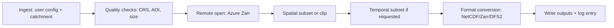

# Data Download Tool - Process and Validation Specification

Version: 1.0
Last Updated: 2026-02-24

## Objective / Rationale

Once the user selects the datasets needed, they should be able to download them. The download tool should also allow download of any scripts. It should create a folder structure on the user's machine following a predetermined logic that fits the scripts that may need to be run, for one reason or another.

Current implementation notes:

- Dataset download and folder layout for datasets and logs are implemented.
- Script download is not implemented in code yet and is listed as a requirement.

## Processing Steps / Algorithms (with Diagram)



### Numbered Pipeline Steps (implemented)

1. Ingest

- Inputs: catchment (shapefile, GeoDataFrame, or manual extent), dataset selection, output base, optional time range
- Outputs: validated catchment geometry and user options

1. Quality checks

- Inputs: catchment geometry
- Outputs: validated geometry, rejected with error if AOI overlap or size limits fail

1. Catalog lookup and remote open

- Inputs: selected dataset category/subcategory
- Outputs: catalog metadata and remotely opened Azure Zarr dataset

1. Spatial subset / optional clip

- Inputs: opened dataset and catchment bounds/geometry
- Outputs: spatially subset dataset (with optional catchment mask)

1. Temporal subset (optional)

- Inputs: subset dataset and optional time range
- Outputs: time-filtered dataset for temporal products

1. Format conversion

- Inputs: xarray Dataset
- Outputs: NetCDF (.nc), Zarr (directory), or DFS2 (.dfs2)

1. Write outputs and append log

- Inputs: converted output and run metadata
- Outputs: file written to `data/{category}/{subcategory}/` and entry appended to `logs/download_log.json`

## Folder Structure (Implemented)

The downloader writes outputs using a dataset-first structure and logs each run in a shared log folder.

Current structure:

```
project_root/
  data/
    <category>/
      <subcategory>/
        <subcategory>.<ext>
  logs/
    download_log.json
```

Implementation notes:

- Current code writes datasets to `data/{category}/{subcategory}/{subcategory}.{ext}` and logs to `logs/download_log.json`.
- Advanced project-run folder orchestration is out of scope for this tool.

## Input/Output Schema

For each pipeline stage, specify file format, variable names, units, time resolution, and required metadata.

### Catalog Entry (YAML)

```yaml
climate:
  era5_precipitation:
    path: climate/era5_precipitation/ERA5_precipitation.zarr
    display_name: ERA5 precipitation
    description: ERA5 precipitation
    variable: tp
    temporal: true
    crs: EPSG:4326
    eumtype: Rainfall
    eumunit: millimeter
```

### Download Log Entry (JSON)

```json
{
  "timestamp": "2026-02-24T10:15:30.123456",
  "category": "climate",
  "subcategory": "era5_precipitation",
  "description": "ERA5 precipitation",
  "output_path": "C:/path/to/project/data/climate/era5_precipitation/era5_precipitation.nc",
  "bounds": [7.1, 50.1, 8.4, 51.2],
  "time_range": ["2015-01-01", "2020-12-31"],
  "catchment_shp": "C:/path/to/catchment.shp"
}
```

### Stage-Specific I/O Summary

- Ingest: Shapefile or GeoJSON; CRS metadata required; manual extent uses EPSG code
- Quality checks: Geometry and CRS; AOI overlap threshold; size limits in km2
- Spatial subset: Zarr dataset with lat/lon or x/y dims; CRS from catalog
- Temporal subset: Time dimension named time/date/t; ISO 8601 date strings
- Format conversion: NetCDF, Zarr (v2), DFS2; variable names from catalog

### 4.3 Upstream Tool Inputs

No upstream tools are required by the downloader. If future preprocessing tools are added (for example, QA or resampling), their outputs should match the Zarr catalog schema above.

## Dependencies

Required software libraries, scripts, and computing resources:

- Core: numpy, pandas, xarray, zarr, dask, netCDF4
- Geospatial: geopandas, shapely, rasterio, rioxarray, pyproj, fiona
- Azure: adlfs, fsspec, azure-storage-blob, azure-identity
- Optional: mikeio (DFS2), matplotlib/cartopy (visualization)
- Recommended system: >= 2 GB RAM, disk sized to dataset/time range

## Validation / QC

Checks to ensure outputs are consistent, physically realistic, and compatible with downstream models:

- Catchment CRS is defined and AOI overlap is validated
- Catchment size is within min/max thresholds
- Dataset spatial dims are detected; clip is only applied to spatial variables
- Time slicing only applied when a time dimension exists

## Error Handling

How missing data, corrupt files, or unexpected formats are handled:

- Missing catalog entry: ValueError with dataset not found
- Azure access errors: ConnectionError after connection test fails
- Spatial subset failure: fallback to full dataset with warning
- Output path locked: remove_path_with_retry retries with backoff

Expected failure modes and recovery strategies:

- SAS token expired -> retry with new token; alert user to update credentials
- No AOI overlap -> abort with validation error
- Empty spatial subset -> fallback to nearest-neighbor selection

Sample error messages and alert recipients:

- "Cannot connect to Azure storage" -> user notified in notebook output
- "AOI validation failed" -> user notified in notebook output

## Performance Requirements

Time limits, computational constraints, scalability:

- Expected runtime depends on dataset size and network throughput
- Spatial subsetting minimizes data transfer where possible
- DFS2 conversion may be CPU-intensive for large time series

Representative data volume targets:

- Small catchment (<= 10k grid cells): minutes per dataset
- Large catchment (>= 100k grid cells): tens of minutes per dataset

Internet speed assumptions for the estimates above:

- Fast connection (>= 100 Mbps): runtimes are typically near the lower end of the ranges
- Moderate connection (25-100 Mbps): use the listed ranges as-is
- Slow connection (< 25 Mbps): expect runtimes to increase substantially

Scaling strategy:

- Use smaller time windows for testing
- Avoid mask_on_catchment unless required for accuracy
- Prefer Zarr output when reusing in analysis notebooks

## Optional Cross-References

- Downstream models consuming outputs: not specified in this repository
- Analysis and visualization: outputs can be plotted using analysis/visualization.py
- DSS (5.6): No DSS module is present; outputs are not directly visualized in a DSS
