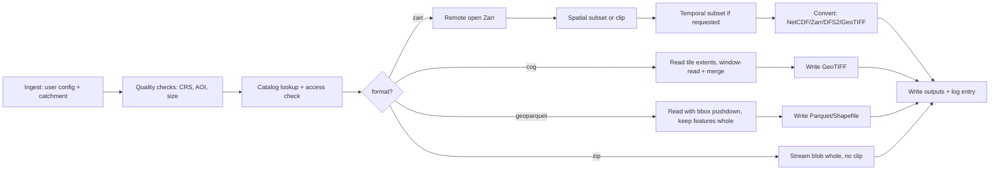

# Data Download Tool - Process and Validation Specification

Version: 1.1

## Objective / Rationale

Once the user selects the datasets needed, they should be able to download them. The download tool should also allow download of any scripts. It should create a folder structure on the user's machine following a predetermined logic that fits the scripts that may need to be run, for one reason or another.

Current implementation notes:

- Dataset download and folder layout for datasets and logs are implemented.
- Script download is not implemented in code yet and is listed as a requirement.

## Processing Steps / Algorithms (with Diagram)


```mermaid
flowchart LR
  A[Ingest: user config + catchment] --> B[Quality checks: CRS, AOI, size]
  B --> C[Catalog lookup + access check]
  C --> D{format?}
  D -->|zarr| E[Remote open Zarr] --> F[Spatial subset or clip] --> G[Temporal subset if requested] --> H[Convert: NetCDF/Zarr/DFS2/GeoTIFF]
  D -->|cog| I[Read tile extents, window-read + merge] --> J[Write GeoTIFF]
  D -->|geoparquet| K[Read with bbox pushdown, keep features whole] --> L[Write Parquet/Shapefile]
  D -->|zip| M[Stream blob whole, no clip]
  H --> N[Write outputs + log entry]
  J --> N
  L --> N
  M --> N
```

### Numbered Pipeline Steps (implemented)

1. Ingest

- Inputs: catchment (shapefile, GeoDataFrame, or manual extent), dataset selection, output base, optional time range
- Outputs: validated catchment geometry and user options

1. Quality checks

- Inputs: catchment geometry
- Outputs: validated geometry, rejected with error if AOI overlap or size limits fail

1. Catalog lookup, access check, and remote open

- Inputs: selected dataset category/subcategory
- Outputs: catalog metadata (merged from the four catalogs) and a filesystem for the entry —
  built-in SAS, anonymous for public containers, or built from the entry's `credential_env`
  variable. A missing or blank token raises `PermissionError` here, before anything is written.
- Then, per the entry's `format`: a remotely opened Zarr dataset, COG tile handles, a GeoParquet
  reader, or a blob stream for a zip bundle

1. Spatial subset / optional clip

- Inputs: opened dataset and catchment bounds/geometry
- Outputs: for Zarr, a spatially subset dataset (with optional catchment mask); for COG, only the
  tiles intersecting the catchment, window-read and merged; for GeoParquet, every feature
  intersecting the catchment kept **whole**, with no geometry truncation
- Zip bundles skip this step entirely — they are never clipped

1. Temporal subset (optional)

- Inputs: subset dataset and optional time range
- Outputs: time-filtered dataset for temporal products. Static layers (COG, GeoParquet, zip) declare
  `temporal: false` and skip this step

1. Format conversion

- Inputs: xarray Dataset, or a GeoDataFrame for vector layers
- Outputs: NetCDF (.nc), Zarr (directory), DFS2 (.dfs2) or GeoTIFF (.tif) for rasters; GeoParquet
  (.parquet) or Shapefile (.shp) for vectors. Zip bundles are written verbatim and ignore
  `output_format`

1. Write outputs and append log

- Inputs: converted output and run metadata
- Outputs: file written to `data/{category}/{subcategory}/` and entry appended to `logs/download_log.json`
- A failed whole-blob copy removes the partial file

## Folder Structure (Implemented)

The downloader writes outputs using a dataset-first structure and logs each run in a shared log folder.

Current structure:

```
project_root/
  data/
    <category>/
      <subcategory>/
        <subcategory>.<ext>
  logs/
    download_log.json
```

Implementation notes:

- Current code writes datasets to `data/{category}/{subcategory}/{subcategory}.{ext}` and logs to `logs/download_log.json`.
- Advanced project-run folder orchestration is out of scope for this tool.

## Input/Output Schema

For each pipeline stage, specify file format, variable names, units, time resolution, and required metadata.

### Catalog Entry (YAML)

Zarr time series (`dataset_catalog.yaml`):

```yaml
climate:
  era5_precipitation:
    path: climate/era5_precipitation/ERA5_precipitation.zarr
    display_name: ERA5 precipitation
    description: ERA5 precipitation
    variable: tp
    temporal: true
    crs: EPSG:4326
    eumtype: Rainfall
    eumunit: millimeter
    data_value_type: StepAccumulated
```

Static COG raster (`cog_catalog.yaml`) — `tiled: true` makes `path` a tile prefix:

```yaml
topography:
  cop_dem:
    path: topography/cop_dem/
    display_name: Copernicus DEM
    format: cog
    container: cogs
    anon: true
    tiled: true
    temporal: false
    crs: EPSG:4326
```

Access-restricted zip bundle (`partner_data_catalog.yaml`) — only the download is gated; the entry
itself stays listable:

```yaml
restricted_partner:
  czech_globe_ms4_full:
    path: Czech Globe MS4 full.zip
    display_name: Czech Globe MS4 (full)
    format: zip
    container: external-shared-after-end
    anon: false
    credential_env: PDP_AFTER_END_SAS
    temporal: false
```

### Download Log Entry (JSON)

```json
{
  "timestamp": "2026-02-24T10:15:30.123456",
  "category": "climate",
  "subcategory": "era5_precipitation",
  "description": "ERA5 precipitation",
  "output_path": "C:/path/to/project/data/climate/era5_precipitation/era5_precipitation.nc",
  "bounds": [7.1, 50.1, 8.4, 51.2],
  "time_range": ["2015-01-01", "2020-12-31"],
  "catchment_shp": "C:/path/to/catchment.shp"
}
```

### Stage-Specific I/O Summary

- Ingest: Shapefile or GeoJSON; CRS metadata required; manual extent uses EPSG code
- Quality checks: Geometry and CRS; AOI overlap threshold; size limits in km2
- Access check: `credential_env` variable present and non-blank for restricted entries
- Spatial subset: Zarr dataset with lat/lon or x/y dims, or COG tiles, or GeoParquet features; CRS from catalog
- Temporal subset: Time dimension named time/date/t; ISO 8601 date strings; skipped for static layers
- Format conversion: NetCDF, Zarr (v2), DFS2, GeoTIFF for rasters; GeoParquet or Shapefile for vectors; verbatim for zip. Variable names from catalog

### 4.3 Upstream Tool Inputs

No upstream tools are required by the downloader. If future preprocessing tools are added (for example, QA or resampling), their outputs should match the relevant catalog schema above.

## Dependencies

Required software libraries, scripts, and computing resources:

- Core: numpy, pandas, xarray, zarr, dask, netCDF4
- Geospatial: geopandas, shapely, rasterio, rioxarray, pyproj, fiona
- Azure: adlfs, fsspec, azure-storage-blob, azure-identity
- Optional: mikeio (DFS2), matplotlib/cartopy (visualization)
- Recommended system: >= 2 GB RAM, disk sized to dataset/time range

## Validation / QC

Checks to ensure outputs are consistent, physically realistic, and compatible with downstream models:

- Catchment CRS is defined and AOI overlap is validated
- Catchment size is within min/max thresholds
- Dataset spatial dims are detected; clip is only applied to spatial variables
- Time slicing only applied when a time dimension exists

## Error Handling

How missing data, corrupt files, or unexpected formats are handled:

- Missing catalog entry: ValueError with dataset not found
- Azure access errors: ConnectionError after connection test fails
- Missing/blank `credential_env` variable: PermissionError naming the variable and container, raised before anything is written
- Spatial subset failure: fallback to full dataset with warning
- Output path locked: remove_path_with_retry retries with backoff
- Interrupted whole-blob (zip) copy: partial file removed

Expected failure modes and recovery strategies:

- SAS token expired -> retry with new token; alert user to update credentials
- Restricted dataset without a token -> PermissionError; user requests the token and sets it in `.env` (see `.env.example`)
- No AOI overlap -> abort with validation error
- Empty spatial subset -> fallback to nearest-neighbor selection

Sample error messages and alert recipients:

- "Cannot connect to Azure storage" -> user notified in notebook output
- "AOI validation failed" -> user notified in notebook output

## Performance Requirements

Time limits, computational constraints, scalability:

- Expected runtime depends on dataset size and network throughput
- Spatial subsetting minimizes data transfer where possible
- DFS2 conversion may be CPU-intensive for large time series

Representative data volume targets:

- Small catchment (<= 10k grid cells): minutes per dataset
- Large catchment (>= 100k grid cells): tens of minutes per dataset

Internet speed assumptions for the estimates above:

- Fast connection (>= 100 Mbps): runtimes are typically near the lower end of the ranges
- Moderate connection (25-100 Mbps): use the listed ranges as-is
- Slow connection (< 25 Mbps): expect runtimes to increase substantially

Scaling strategy:

- Use smaller time windows for testing
- Avoid mask_on_catchment unless required for accuracy
- Prefer Zarr output when reusing in analysis notebooks

## Optional Cross-References

- Downstream models consuming outputs: not specified in this repository
- Analysis and visualization: outputs can be plotted using analysis/visualization.py
- DSS (5.6): No DSS module is present; outputs are not directly visualized in a DSS
