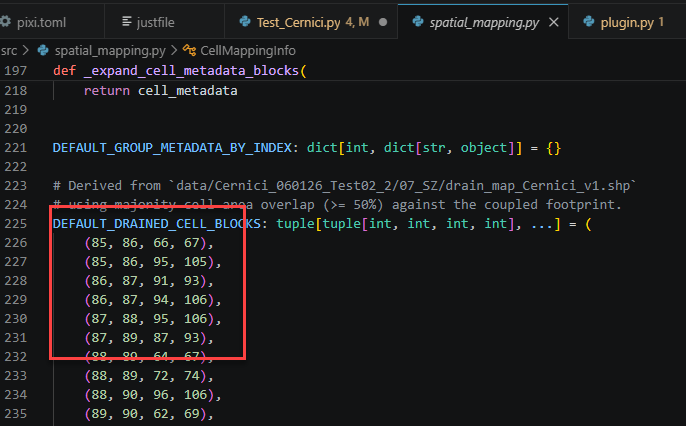
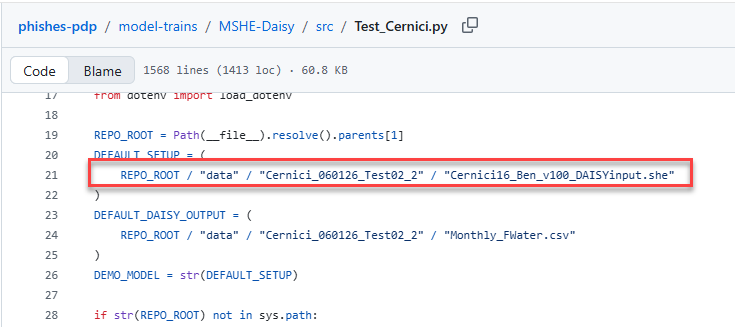
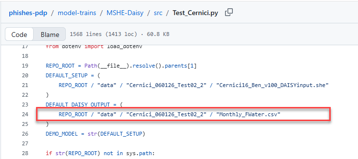
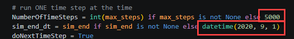
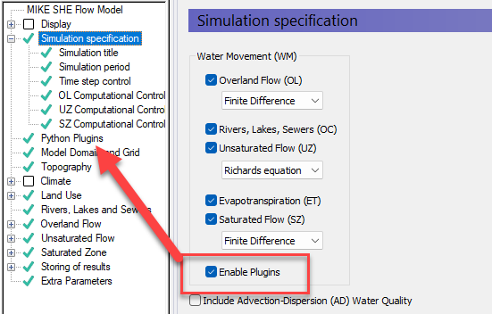
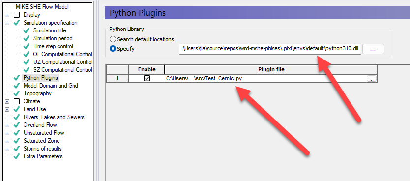

# MIKE SHE - Daisy

The purpose of this model train coupling MIKE SHE - Daisy is to upscale simulations from field scale
to large scale, enabling a user to simulate dynamic mass balance calculation in the soil-water profile
as well as a 3D spatial distribution of soil contamination at watershed scale. In this coupling structure,
Daisy is used for detailed simulation of the effects of changed agricultural practices
(tillage, fertilizing, crop rotation, etc.) on the soil health and the leakage of nutrients and pesticides.
The simulation will be made for selected representative soil profiles.

To incorporate the interaction with groundwater and streams it will be linked with the groundwater
component of MIKE SHE. Results from Daisy substitute those from MIKE SHE’s unsaturated zone
(UZ) flow component in parts of the catchment. DAISY outputs are used to prescribe all fluxes that
MIKE SHE would otherwise calculate internally in the UZ.
MIKE SHE retains its overland, saturated zone, and river/channel routing modules, as well as
unsaturated zone processes where the substitution has not taken place.
The coupling is one-way: Daisy drives MIKE SHE with water and energy fluxes, while MIKE SHE
does not feed back into Daisy. The Daisy-MIKE SHE coupling consists of the following components:
spatial mapping, temporal mapping, and a Quality Control (QC) calculation. Figure 4 shows the
coupling process steps. The spatial mapping step takes place in the beginning, whereas the temporal
mapping step is continuous based on the MIKE SHE UZ time step. The user, in addition to defining user defined settings for the coupling, must supply both models and results, a land use map and a
soil type map.

> [!IMPORTANT]
> **Disclaimer:** This model train couples DAISY output into MIKE SHE via third-party spatial and
> soil-profile inputs, and is provided "as is" for research purposes — it is also not yet final
> (see [Status](#status) below). Read the full [DISCLAIMER.md](DISCLAIMER.md) before relying on
> its outputs.

## Status

Runoff, matrix percolation and matrix drain flow coupling are implemented and run against the
Cernici (Romania) field-site test case, with a passing test suite. It is **not final**: proof that
native MIKE SHE runoff generation is suppressed for coupled cells, and authoritative confirmation of
the matrix-percolation target variable (`SZ_LEAK_FLX` vs `SZ_LEAK_FLO`), remain open. See
[docs/tasks.md](docs/tasks.md) for the current sign-off status per phase.

## Setting up a new site

The code ships wired to the Cernici test case; adapting it to a different DAISY/MIKE SHE pair means
editing a handful of hardcoded locations rather than passing config at runtime. This is version 1 —
a config-driven setup is expected in an update targeted for Q3 2026.

**Prerequisites**: a DAISY model and a MIKE SHE model that both cover the same simulation period,
run without errors, and share the same meteorological boundary conditions — otherwise the coupled
fluxes aren't comparable.

1. **Identify the coupled cells.** Work out which MIKE SHE cells represent the DAISY field and update
   `DEFAULT_DRAINED_CELL_BLOCKS` (and the coupled footprint it belongs to) in
   [src/spatial_mapping.py](src/spatial_mapping.py):

   

2. **Point at the MIKE SHE setup.** Update `DEFAULT_SETUP` in
   [src/Test_Cernici.py](src/Test_Cernici.py) to the target `.she` file:

   

3. **Point at the DAISY results.** Update `DEFAULT_DAISY_OUTPUT` in the same file to the DAISY output
   CSV:

   

4. **Set the simulation length.** A MIKE SHE `.she` file doesn't carry an end time by itself; it's set
   in the driver script via `NumberOfTimeSteps` / `sim_end_dt` — whichever limit is hit first ends the
   run:

   

On execution, the tool copies the MIKE SHE setup to a `*_plugin.she` file, enables the **Python
Plugins** option on it:



and fills in the Python Plugins menu (interpreter + plugin script) automatically:



Results land in the corresponding `*_plugin - Result Files` folder, following normal MIKE SHE
conventions.

## Environment

Managed with [pixi](https://pixi.sh) rather than `uv` — Windows x64 only. **MIKE Zero 2025** must be
installed separately; `pixi.toml` points at its `bin/x64` via the `MIKE_ZERO_X64` activation
variable, so update that path if your installation differs.

```powershell
pixi shell
```

## Commands

```powershell
# Run the full test suite
pixi run python -m pytest tests/

# Full simulation against the Cernici setup (requires MIKE Zero + data files)
pixi run python -m src.Test_Cernici

# Smoke tests: short runs isolating one coupling phase at a time
just runoff-test
just percolation-test
just drain-test

# Print resolved configuration without running
pixi run python -m src.Test_Cernici --print-config
```

`justfile` and `pixi.toml` define further tasks, including cross-run plotting
(`plot-3dsz-crossrun`) and the investigation probes referenced in `docs/tasks.md`.

## Project structure

```
MSHE-Daisy/
├── src/                    # Coupling math, spatial mapping, DAISY I/O, diagnostics, plotting
├── tests/                  # pytest suite
├── docs/                   # Implementation plan, phase sign-offs, exchangeable-items reference
├── pixi.toml / pixi.lock   # Environment (pixi, not uv)
└── justfile                # Smoke-test and reporting recipes
```

`src/investigations/` and `docs/investigations/` hold one-off diagnostic probes and their output
artifacts; both are gitignored because the artifacts run into the hundreds of MB per file.
`docs/setup/images/` holds the screenshots used in [Setting up a new site](#setting-up-a-new-site)
above and is committed normally.

Full architecture, module-by-module notes and coupling conventions are in this project's own
[CLAUDE.md](CLAUDE.md).
